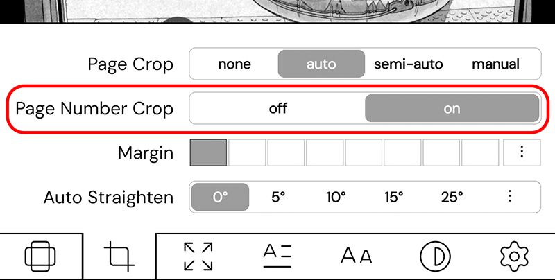

# pagenumbercrop.koplugin

A KOReader plugin that removes page numbers from the bottom of manga pages (CBZ).

 

<picture>

</picture>

## What it does

- Automatically detects and removes the page number from each page.
- **No crop on blank pages** (on by default): pages that are almost entirely white (e.g.
  a chapter divider or a title page with only a small logo) are shown with no crop
  at all, instead of being zoomed into that small element.

Both features only work when **Page Crop** is set to **auto**.

## Installation

Copy the `pagenumbercrop.koplugin` folder to the `plugins/` directory and restart KOReader.

## Usage

Open a CBZ → crop settings → **Page Crop: auto** → **Page Number Crop** on (default).
Optional: **No crop on blank pages** to keep almost-blank pages uncropped.

For updates: menu → **Page Number Crop: check for updates** (or automatically, weekly).

## Compatibility

Tested on KOReader nightly.

#### My  [User Patches](https://github.com/Craftwork2720/koreader-patches) for KOReader. ❤️
