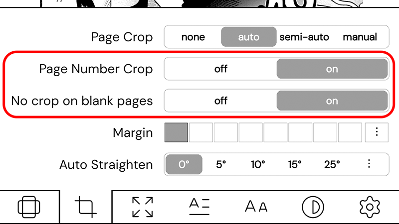

# pagenumbercrop.koplugin

A KOReader plugin that removes page numbers from the bottom of fixed-layout pages
(CBZ, PDF, DjVu).

 

<picture>

</picture>

## What it does

- Automatically detects and removes the page number from each page.
- **No crop on blank pages** (on by default): pages that are almost entirely white (e.g.
  a chapter divider or a title page with only a small logo) are shown with no crop
  at all, instead of being zoomed into that small element.

Both features only work when **Page Crop** is set to **auto**.

## Installation

Copy the `pagenumbercrop.koplugin` folder to the `plugins/` directory and restart KOReader.

## Usage

Open a CBZ/PDF/DjVu → crop settings → **Page Crop: auto** → **Page Number Crop** on (default).
Optional: **No crop on blank pages** to keep almost-blank pages uncropped.

For updates: menu → **Page Number Crop: check for updates** (or automatically, weekly).

## Gestures & keyboard shortcuts

The plugin's features can also be bound to a gesture or keyboard shortcut. Once a
fixed-layout (CBZ/PDF/DjVu) book is open, these actions are available in the gesture
editor under **Fixed layout documents**:

| Action | Effect |
| --- | --- |
| **Crop page number on this page** | Crop on the current page, |
| **Page Number Crop: on / off / toggle** | Switches the *Page Number Crop* option |
| **No crop on blank pages: on / off / toggle** | Switches the *No crop on blank pages* option |

Both *Crop page number on this page* and the toggles still require **Page Crop** to be
set to **auto**. The actions only apply to fixed-layout books and are hidden for
reflowable ones (epub, fb2, txt…).

## Compatibility

Tested on KOReader nightly.

#### My  [User Patches](https://github.com/Craftwork2720/koreader-patches) for KOReader. ❤️
